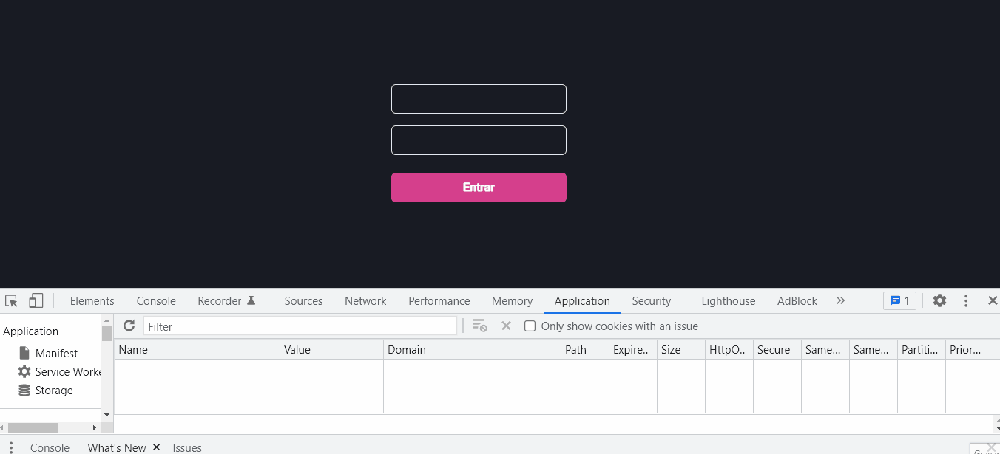

<h1 align="center">NEXT AUTH</h1>

<h2 align="center">Summary</h2>

<p align="center">
    <a href="#about">📙 About</a>
    <a href="#preview">🖼️ Preview</a>
    <a href="#start">📖 How to Start</a>
    <a href="#features">💡 Features</a>
    <a href="#technologies">💻 Technologies</a>
</p>

<h4 align="center">
   ✔️ FeedGet project finished ✔️
</h4>

<h2 id="about">📙 About</H2>

<p>Nextauth is a project focused on the authentication functionality which can be use as supplementary function on other apps. It saves tokens on cookies and redirects the user when logout the application.</p>
<p>This project is originally created on Ignite from <a href="https://www.rocketseat.com.br/">Rocketseat</a> and made by <a href="https://www.linkedin.com/in/kleverson-kenji-iwatani/">Kenji Iwatani</a></p>

---

<H2 id="preview">🖼️ Preview</H2>

<section align="center">
    
</section>

---

<H2 id="start">📖 How to Start</H2>

<h4>Starting this repository</h3>

```bash
# Clone this repository
$ git clone https://github.com/iwataniKenji/feedget

# Access the project directory
$ cd feedget
```

<h4>Server</h4>

```bash
# Access the "server" folder
$ cd server

# Install dependencies
$ yarn

# Start the server
$ yarn dev
```

<h4>Web</h4>

```bash
# Access the "web" folder
$ cd web

# Install dependencies
$ yarn

# Start the application
$ yarn dev
```

---

<H2 id="features">💡 Features</H2>

- [x] Declarative interface with Chakra UI
- [x] Props usage through contexts
- [x] Axios implementation to set communication between front and backend 
- [x] Saves tokens on cookies 
- [x] Recovers authentication state  
- [x] Redirects to home page when user logout 

---

<H2 id="technologies">💻 Technologies</H2>

- [x] <a href="https://nextjs.org/">NextJS</a>
- [x] <a href="https://reactjs.org/">React</a>
- [x] <a href="https://www.typescriptlang.org/">Typescript</a>
- [x] <a href="https://chakra-ui.com/">Chakra UI</a>
- [x] <a href="https://jwt.io/">JWT</a>
- [x] <a href="https://axios-http.com/">Axios</a>
- [x] <a href="https://github.com/maticzav/nookies">Nookies</a>
